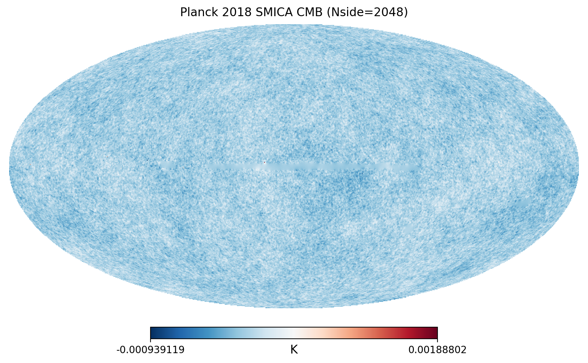
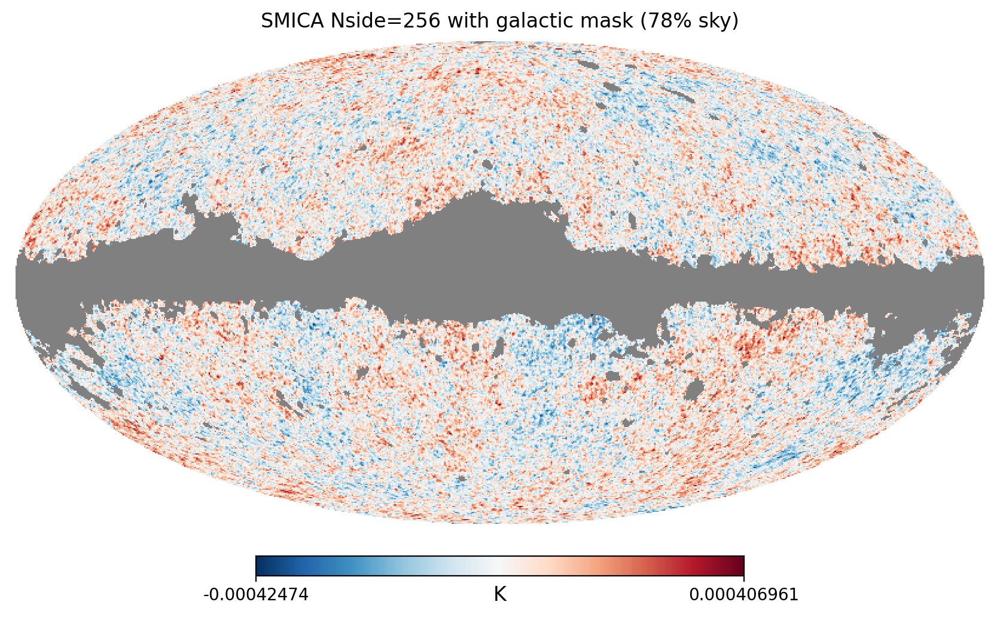
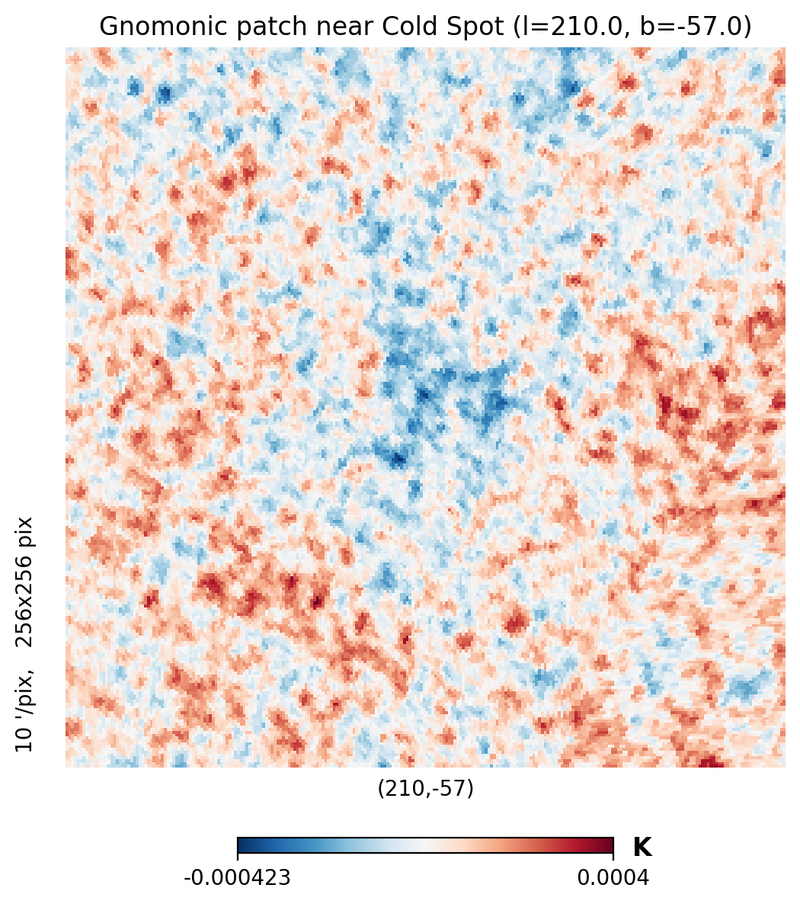
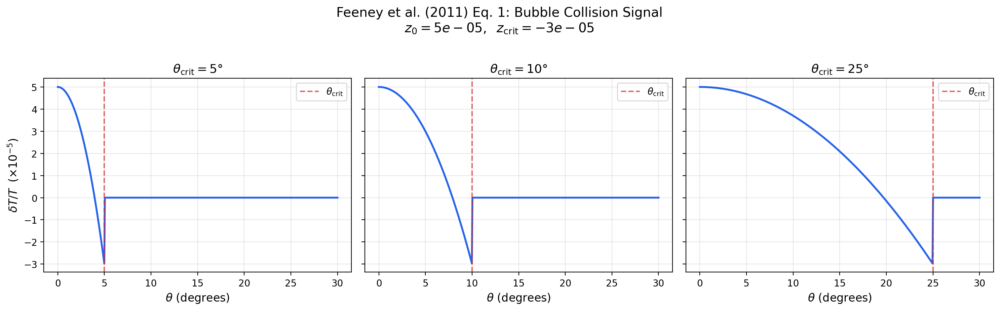
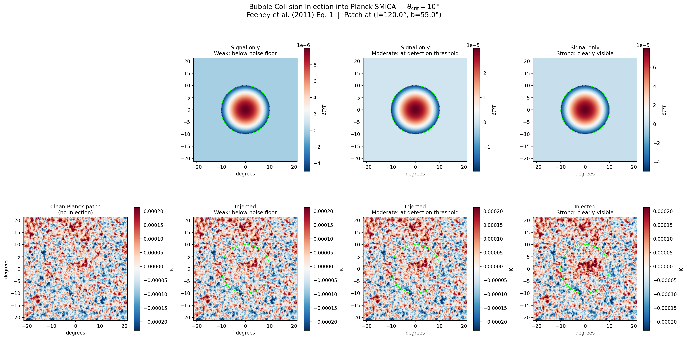

# CMB Bubble Collision Detection

A deep learning pipeline for detecting bubble collision signatures in Cosmic Microwave Background data using the Planck 2018 full sky release.

## Background

In 2011, Feeney, Johnson, Mortlock, and Peiris published the first observational search for bubble collision signatures in CMB data using classical Bayesian methods and blob detection on WMAP 7-year data. They found four candidate features but results were inconclusive due to sensitivity limitations. They explicitly called for the search to be repeated with Planck satellite data using more powerful computational tools.

That follow-up using modern deep learning has never been done.

This project builds a U-Net segmentation model trained on simulated bubble collision signatures and applies it to Planck 2018 CMB data — replacing Feeney et al.'s multi-stage classical pipeline with a single trained model capable of full-sky screening in minutes rather than days.

## What Is a Bubble Collision Signature?

Some theories of cosmic inflation predict our universe is one bubble in a larger multiverse. If another bubble universe collided with ours, it would leave a physical imprint in the CMB: a circular, azimuthally symmetric temperature modulation confined to a disk on the sky. The signature is parameterized by five values:

- **z₀** — temperature amplitude at the center of the disk
- **z_crit** — temperature discontinuity at the causal boundary (edge)
- **θ_crit** — angular radius of the disk (searched range: 5°–25°)
- **θ₀, φ₀** — sky coordinates of the disk center

The signal model follows [Feeney et al. (2011), Eq. 1](https://arxiv.org/abs/1012.1995):

$$\frac{\delta T}{T} = \left[ \frac{z_{\text{crit}} - z_0 \cos\theta_{\text{crit}}}{1 - \cos\theta_{\text{crit}}} + \frac{z_0 - z_{\text{crit}}}{1 - \cos\theta_{\text{crit}}} \cos\theta \right] \Theta(\theta_{\text{crit}} - \theta)$$

## Progress

### Phase 1: Data Foundation — ✅ Complete

Downloaded the Planck 2018 SMICA cleaned CMB map, loaded and visualized HEALPix data, degraded to working resolution (Nside=256), applied the galactic mask, and extracted gnomonic (tangent-plane) projections as flat 256×256 patches.

**Full-sky Planck 2018 SMICA CMB (Nside=2048, 50 million pixels):**



**With galactic mask applied (78% sky unmasked) at Nside=256:**



**Gnomonic (flat-sky) patch near the CMB Cold Spot — this is the input format for the U-Net:**



### Phase 2: Synthetic Data Generator — 🔬 In Progress

Implemented the bubble collision signal model from Feeney et al. (2011) Eq. 1. The signal is a linear temperature modulation in cos(θ) confined to a disk of angular radius θ_crit, with an optional discontinuity at the causal boundary.

**Signal profile at three angular scales (5°, 10°, 25°):**



**Signal injected into a real Planck SMICA patch at increasing amplitudes:**

Top row: signal template in isolation. Bottom row: the same patch of real CMB sky with the signal injected. At weak amplitude the signal is invisible — buried in CMB noise. At strong amplitude the circular disk is obvious. The U-Net must learn to detect signals in the transition zone.



**Parameter space sweep — z₀ (center amplitude) vs z_crit (edge discontinuity):**


Still to do in Phase 2:
- [ ] Generate CMB realizations using CAMB (or work with Planck noise maps)
- [ ] Build automated injection pipeline at random sky coordinates
- [ ] Produce thousands of positive/negative training patch pairs
- [ ] Validate injection statistics across parameter ranges

### Phase 3: U-Net Model — Upcoming

Train a U-Net segmentation model with an EfficientNet encoder backbone. Input: 256×256 CMB patches covering ~40° field of view. Output: pixel-level probability maps indicating regions consistent with a bubble collision signature.

### Phase 4: Validation — Upcoming

- Sensitivity curves at 5°, 10°, and 25° angular scales (detection rate vs. injection amplitude)
- False positive rate on clean (no injection) patches
- Precision-recall curves at varying detection thresholds
- Injection-recovery tests on real Planck maps
- GradCAM activation maps to verify model attention on correct spatial features
- Direct comparison to Feeney et al. (2011) sensitivity benchmarks (Figures 11, 17)

### Phase 5: Planck Inference — Upcoming

Tile the full unmasked Planck sky with overlapping 40° patches. Run inference and stitch outputs into a full-sky probability map. Identify candidate regions above detection threshold. Cross-reference against known CMB anomalies (Cold Spot, hemispherical asymmetry). Validate candidates across independent Planck cleaning pipelines (SMICA, NILC, SEVEM, Commander).

### Phase 6: Paper and Release — Upcoming

Write up results. Release trained model weights, synthetic data generator, and inference pipeline as open-source tools for the CMB research community.

## Quick Start

```bash
# Set up the environment
conda env create -f environment.yml
conda activate cmb

# Phase 1: Download Planck data and generate exploration plots
python scripts/phase1_explore.py

# Phase 2: Generate signal model visualizations
python scripts/phase2_signal_model.py
```

## Datasets

| Dataset            | Purpose                                        | Source                                             |
|--------------------|------------------------------------------------|----------------------------------------------------|
| Planck 2018 SMICA  | Primary inference target                       | [Planck Legacy Archive](https://pla.esac.esa.int/) |
| CAMB simulations   | Synthetic CMB realizations for training        | Generated via [CAMB](https://camb.info/)           |
| CMB-ML (ICCV 2025) | Pre-processed CMB data for ML                  | [CMB-ML](https://github.com/CMB-ML)               |
| WMAP 7-year        | Additional validation / generalization testing | [LAMBDA](https://lambda.gsfc.nasa.gov/)            |

## Tech Stack

- **healpy** — HEALPix map handling and patch extraction
- **CAMB** — CMB power spectrum and map simulation
- **PyTorch** — Model training and inference
- **segmentation-models-pytorch** — U-Net with EfficientNet encoder
- **numpy / scipy** — Signal injection and data processing

## Hardware

- 2× NVIDIA RTX 3090 (48 GB VRAM total)

## Key References

- Feeney, Johnson, Mortlock & Peiris (2011). *First Observational Tests of Eternal Inflation.* [arXiv:1012.3667](https://arxiv.org/abs/1012.3667)
- Feeney, Johnson, Mortlock & Peiris (2011). *First Observational Tests of Eternal Inflation: Analysis Methods and WMAP 7-Year Results.* [arXiv:1012.1995](https://arxiv.org/abs/1012.1995)
- Zhang et al. (2024). *CMBubbles: Bubble Collision Detection in the CMB.*
- Górski et al. (2005). *HEALPix: A Framework for High-Resolution Discretization and Fast Analysis of Data Distributed on the Sphere.*

## Why This Matters

This project is not a discovery tool. It is a triage tool. It screens the full CMB sky in minutes and outputs a probability map flagging regions of interest for follow-up with traditional Bayesian analysis. Even a null result constrains the bubble collision parameter space. The pipeline is designed to be reusable on future CMB datasets (CMB-S4, Simons Observatory) where automated screening will be essential due to data volume.

## License

MIT

## Authors

William Starks
Gus Marcum
