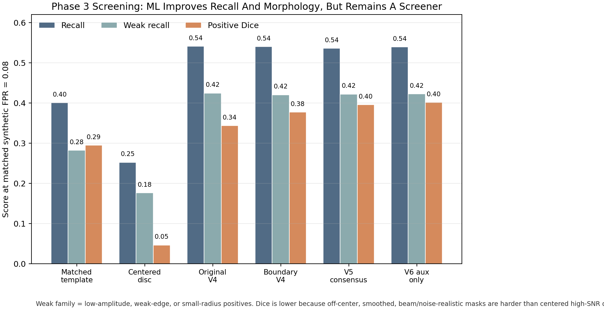
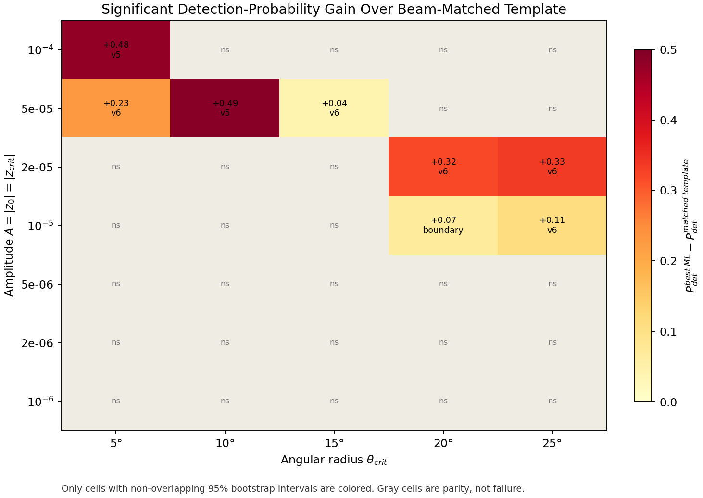
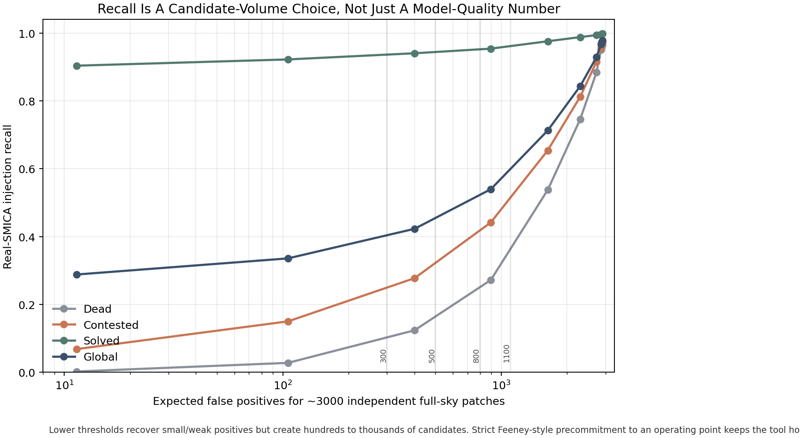
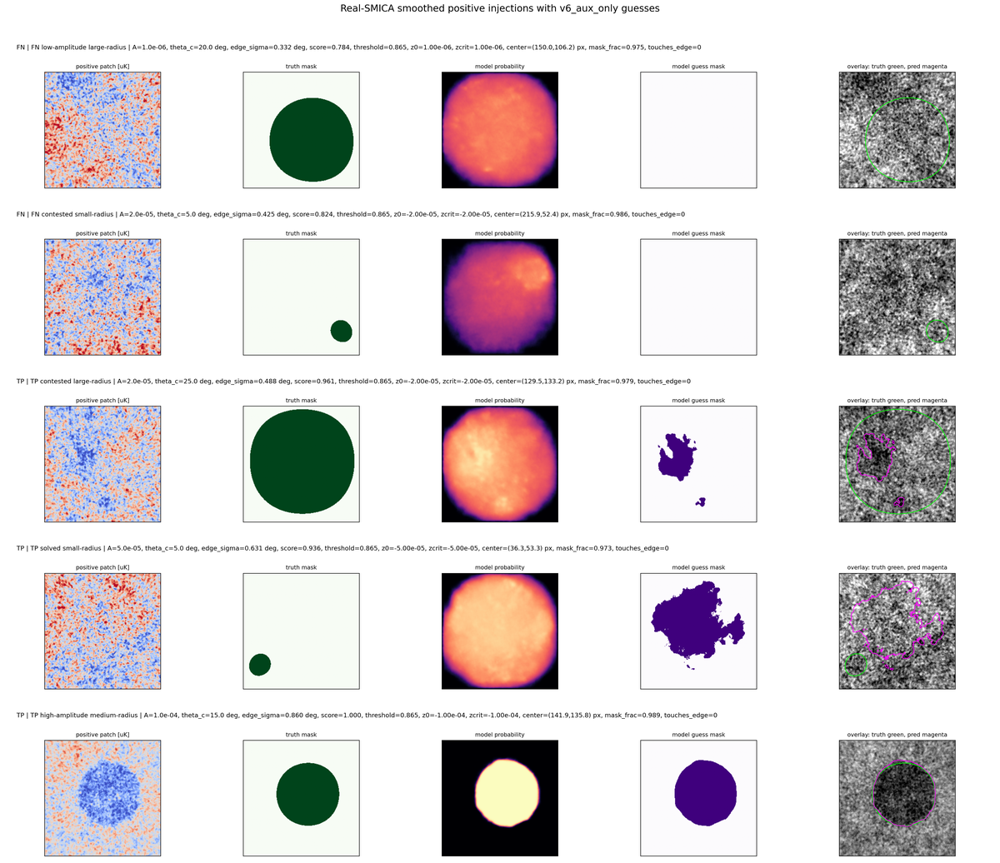

# CMB Bubble Collision Detection

Planck-era machine-learning candidate screening for localized bubble-collision signatures in the Cosmic Microwave Background.

This repository is not claiming a cosmological detection. It implements and audits a reproducible screening front end: generate physically motivated candidates, rank them, emit structured outputs, and hand promising regions to classical or Bayesian follow-up. That framing is deliberate. Feeney et al.'s WMAP pipeline did candidate localization, edge checks, Bayesian parameter estimation, model comparison against LambdaCDM, and interpretation in terms of the expected detectable collision count. This project currently covers the candidate-screening and handoff layer.

Working claim:

> A reproducible Planck-era ML candidate-screening method for localized bubble-collision signatures, intended to accelerate or supplement classical follow-up.

## Current State

- Phase 1 defines the observable domain: Planck 2018 cleaned maps, mask-aware sky coordinates, and gnomonic patch geometry.
- Phase 2 builds the current synthetic generator: Feeney Eq. 1 disc templates, multiplicative injection, CAMB backgrounds, Planck mask geometry, beam/noise realism, provenance-clean splits, and real-map null controls.
- Phase 3 contains the current screening stack: U-Net branches, boundary-aware variants, matched-template and centered-disc baselines, sensitivity curves, real-SMICA recalibration, threshold-volume analysis, and machine-readable candidate outputs.
- The best current interpretation is operational, not triumphant: ML improves screening and morphology relative to simple classical screens in several regimes, but recall remains limited for low-amplitude, small-radius, weak-edge cases.
- A focused Nside=512 probe did not justify a full 512 retrain. Positive-only recall improved only by saturating on real-SMICA nulls. The current practical baseline remains Nside=256 with calibrated operating points.

## Signal Model

Bubble-collision signatures are modeled as localized, azimuthally symmetric CMB temperature modulations confined to a causal disc. Following Feeney, Johnson, Mortlock, and Peiris, the leading-order template is

```math
\frac{\delta T}{T} =
\left[
\frac{z_{\rm crit} - z_0 \cos\theta_{\rm crit}}{1 - \cos\theta_{\rm crit}}
+
\frac{z_0 - z_{\rm crit}}{1 - \cos\theta_{\rm crit}}\cos\theta
\right]\Theta(\theta_{\rm crit}-\theta).
```

Key parameters:

- `z0`: central modulation amplitude.
- `zcrit`: boundary amplitude/discontinuity term.
- `theta_crit`: angular radius of the affected disc, currently sampled over `5 deg` to `25 deg`.
- `theta0, phi0`: sky position of the disc center.

The generator uses the multiplicative injection form, not an additive shortcut:

```math
T_{\rm injected} = (1 + f)(T_{\rm CMB}) .
```

The `sin(theta_crit)` sampling law in this repository is a training-design choice motivated by the Feeney geometry discussion. It is not a Bayesian inference prior.

## Data And Geometry

The observable domain is Planck-era, patch-based, and mask-aware.


**Figure 1.** Planck 2018 SMICA CMB map. SMICA is the primary real-map target for the current screening and null-control tests.


**Figure 2.** Planck common mask applied to the cleaned CMB map. The coordinate pool is drawn from clean unmasked regions with mask-fraction checks, not only center-pixel checks.


**Figure 3.** Example gnomonic patch. The current working product uses `256 x 256` patches at `13 arcmin/pixel`, covering roughly `55 deg` across.

## Phase 2 Generator

The current generator is intentionally stricter than an early ML demo:

- It uses independent CAMB CMB realizations rather than repeatedly training on one real SMICA sky.
- It injects Feeney-style disc templates multiplicatively.
- It balances sign quadrants for `z0` and `zcrit`.
- It randomizes signal centers within patches to remove center-bias shortcut learning.
- It enforces provenance-clean train/validation splits by coordinate and CMB realization.
- It supports beam smoothing, instrumental noise, real-map null controls, and stratified validation products.
- It stores metadata needed to trace patches back to sky coordinates and generation settings.


**Figure 4.** Representative Feeney-template profiles. The generator preserves the long-wavelength disc modulation and causal-boundary structure instead of using generic circular blobs.


**Figure 5.** Phase 2 distribution checks. These checks exist to prevent the model from learning hidden generator shortcuts such as one sign quadrant, one radius band, or a narrow amplitude slice.


**Figure 6.** Example synthetic training patches. The lower visual salience of many examples is intentional: the data include weak amplitudes, mixed signs, off-center discs, beam/noise effects, and smoothed boundaries, all of which are closer to the Feeney search problem than centered high-SNR toy discs.

## Phase 3 Screening Results

Phase 3 is now evaluated against classical baselines on the same audited splits. The five learned/model-policy variants below were important investigative controls: they tested whether boundary-aware losses, consensus policies, auxiliary heads, and branch averaging produced materially different behavior. The current working path is narrower. We are focusing on the two-model pair `v6_aux_only + matched_template` because it keeps the best morphology-aligned ML branch while retaining an interpretable Feeney-template classical score, without carrying the calibration and maintenance burden of several near-tied learned branches.

At matched synthetic FPR `0.08` on the independent stratified validation set:

| method | AUROC | AUPRC | recall | weak recall | positive Dice |
|---|---:|---:|---:|---:|---:|
| matched template | `0.712` | `0.881` | `0.401` | `0.282` | `0.295` |
| centered disc | `0.639` | `0.833` | `0.252` | `0.176` | `0.046` |
| original V4 | `0.775` | `0.914` | `0.541` | `0.425` | `0.344` |
| boundary V4 | `0.774` | `0.914` | `0.540` | `0.420` | `0.377` |
| V5 consensus | `0.774` | `0.913` | `0.536` | `0.422` | `0.396` |
| V6 aux only | `0.773` | `0.913` | `0.539` | `0.422` | `0.401` |



**Figure 7.** Current Phase 3 comparison at matched FPR. The metrics are lower than early high-SNR baselines because the current data intentionally removes shortcuts: off-center injection, provenance-clean splits, weak amplitudes, smoothed causal boundaries, beam/noise effects, and real-map null calibration. That is the right direction scientifically even when it makes headline recall less flattering.

## Sensitivity Versus Matched Template

At matched synthetic FPR `0.05`, the best ML branch significantly beats the beam-matched Feeney-template screen in `8 / 35` amplitude-radius cells and shows no significant losses. This is a localized gain, not universal dominance.

Representative significant cells:

| amplitude `A` | `theta_crit` | matched template `P_det` | best ML `P_det` |
|---:|---:|---:|---:|
| `1e-5` | `25 deg` | `0.065` | `0.175` |
| `2e-5` | `20 deg` | `0.235` | `0.555` |
| `2e-5` | `25 deg` | `0.375` | `0.710` |
| `5e-5` | `5 deg` | `0.065` | `0.295` |
| `5e-5` | `10 deg` | `0.490` | `0.980` |
| `1e-4` | `5 deg` | `0.500` | `0.980` |



**Figure 8.** Significant gain over a beam-matched template screen. Gray cells are not ML failures; they are cells where the confidence interval overlaps parity. The lower-left region remains hard because low amplitude and small angular radius give limited integrated signal-to-noise, especially after Feeney-faithful smoothing and realistic background structure.

## Real-SMICA Calibration

A real-SMICA injection gate initially looked like a domain-gap failure. Recalibration showed the dominant issue was threshold mismatch:

| method | CAMB threshold | SMICA-null threshold | real recall at CAMB threshold | real recall after SMICA recalibration |
|---|---:|---:|---:|---:|
| `v6_aux_only` | `0.992082` | `0.888469` | `0.262` | `0.353` |
| `matched_template` | `76.977921` | `61.829514` | `0.238` | `0.323` |

Interpretation: thresholds calibrated on CAMB negatives were too strict on real SMICA. The model transfers better than the first gate suggested, but recall is still a candidate-volume tradeoff rather than a solved detection problem.

## Threshold And Candidate Volume

The current detector can recover more contested positives by lowering the threshold, but false-positive volume rises quickly.

| threshold | contested recall | solved recall | expected FP over 3000 independent patches |
|---:|---:|---:|---:|
| `0.75` | `0.654` | `0.976` | `1631` |
| `0.80` | `0.442` | `0.954` | `895` |
| `0.85` | `0.278` | `0.940` | `401` |
| `0.90` | `0.150` | `0.922` | `106` |



**Figure 9.** Recall versus expected candidate burden. The numbers are lower than a toy segmentation benchmark because the operating point is being treated in the Feeney spirit: thresholds must be fixed against null controls before real-map use, rather than tuned after looking at candidates. High recall is available, but it costs hundreds to thousands of follow-up candidates.



**Figure 10.** Diagnostic real-SMICA injection examples. The failures are informative: small-radius or low-amplitude discs often produce diffuse probability maps just below threshold, while larger or stronger discs are recovered cleanly. This is consistent with an integrated-SNR limitation, not simple model blindness.

## Current Operating Direction

Current Phase 3 should be treated as a two-score screening system, not a five-model deployment stack.

- Run `v6_aux_only` as the current ML morphology and candidate-score branch for contained positives.
- Run `v7_mixed_ft` as the complementary ML branch for truncated / edge-crossing positives. See the 2026-04-17 portfolio-decision update below.
- Run `matched_template` as the classical Feeney-template reference, fallback, and independent ranking score.
- Calibrate all thresholds on real-map null controls, not CAMB negatives alone.
- Preserve the ML score, matched-template score, threshold decisions, mask, estimated radius, sky metadata, and template-fit artifacts in each candidate record.
- Keep the older learned branches as documented ablation evidence and regression checks, not as the preferred operating stack.

The earlier multi-branch policies remain useful as investigative benchmarks. They showed that consensus-style verification can be very clean, but they did not justify the added complexity as the default deployment path:

| policy | precision | recall | FPR | F1 |
|---|---:|---:|---:|---:|
| `v5_only` | `0.969` | `0.501` | `0.041` | `0.660` |
| `score_avg_only` | `0.975` | `0.495` | `0.032` | `0.656` |
| `matched_template_only` | `0.948` | `0.348` | `0.049` | `0.509` |
| `normal_candidate` | `0.980` | `0.474` | `0.025` | `0.639` |

On the `5000`-patch SMICA null-control set, `matched_template`, `v5_consensus`, `score_avg`, `normal_candidate`, and `all_candidates` each produced `0 / 5000` null candidates at their frozen thresholds. That result is retained because it verifies the investigation, not because all five branches should be run by default.

## 2026-04-17 Update: Mixed Geometry And The Portfolio Decision

Recent work identified and corrected a physical-correctness limitation and produced a real-SMICA gate result that shifted the operating path to a two-model portfolio. Full detail in `PROJECT_HANDOFF.md` Section 21 and `work/v7_real_sky_gate.md`.

Summary:

- The Phase 2 positive generator previously produced only fully contained discs. Real full-sky patch tiling will observe clipped and edge-crossing bubbles. The generator and validation harness were extended to produce mixed and truncated geometries with explicit truth fields (`fully_contained`, `target_touches_edge`, `visible_target_fraction`, `signal_center_in_patch`).
- A mixed-geometry stratified validation set (`validation_stratified_mixed_geometry_v1`) and a mixed-geometry training set (`training_v5_mixed_geometry`, 30% truncated) were built with the same provenance discipline as the contained v1 products.
- Evaluating `v6_aux_only` on the mixed-geometry validation confirmed a center-framed shortcut: truncated recall collapsed relative to contained recall. The branch `v7_mixed_ft` was produced by fine-tuning `v6_aux_only` on `training_v5_mixed_geometry`. On the synthetic CAMB mixed-geometry benchmark, `v7_mixed_ft` Pareto-dominated `v6_aux_only`.
- A dedicated real-SMICA validation gate then scored both branches on 500 SMICA backgrounds × 7 amplitudes × 5 θ × 4 sign-quadrants = 17500 positives per geometry, with thresholds calibrated on 5000 real-SMICA null patches at FPR 0.05, 0.08, 0.10.
- On real SMICA the story reversed for contained geometry. At FPR 0.05 the contained recall was `v7_mixed_ft 0.286` vs `v6_aux_only 0.348`. At FPR 0.08 the gap narrowed to `0.357` vs `0.372`. The synthetic contained-geometry advantage did not survive the CAMB-to-SMICA domain shift.
- On truncated and edge-crossing positives `v7_mixed_ft` won by the margins it was designed to win by: truncated recall `0.246` vs `0.205`, center-outside-patch `0.207` vs `0.163`, low-visibility `0.196` vs `0.145`.
- The initial response was a two-model portfolio routed by geometry. Subsequent Batch 3 evaluation (`work/batch3_geometry_router.md`) showed that simple portfolio policies (OR, AND, rank-max, heuristic geometry router) all underperform `v6_only` at our deployment FPR of 0.08 because v6 and v7 false positives are strongly correlated. A 200-tree gradient-boosted classifier on six frozen-mask features (v6 / v7 baseline, v6 / v7 mf_on_mask, v6 / v7 smooth_multi) does beat `v6_only` by +3.1 to +4.5 points recall in every (geometry, FPR target) cell we measured, with cross-geometry training and a disjoint null train/eval split.
- Batch 4 (`work/batch4_router_features.md`) extended the router feature set with 4 truth-free geometry proxies per model, taking the GBT from 6 to 14 features. Under clean-null calibration the 14-feature router appeared to lift the gate-cell recall by +0.043. Batch 5 (`work/batch5_fullsky_calibration_gap.md`) then ran a full-sky Nside=8 tiling audit of all four Planck cleaned maps and found that the calibration pool used by PR #6-9 systematically excludes mask-adjacent sky (`MASK_THRESHOLD = 0.95`). Under deployment-representative tile calibration the 14-feature router's lift evaporates on SMICA (−0.001), survives weakly on NILC (+0.023), and *reverses* on SEVEM (−0.045) and Commander (−0.036). The geometry features specifically overfit the clean-pool mask-fraction distribution. The 14-feature router is therefore **no longer recommended as the primary deployment policy**. The shipped 6-feature GBT (PR #8) and `v6_aux_only` (baseline) are also pending deployment-representative recalibration — their PR-reported recall numbers are on the same biased pool. See `PROJECT_HANDOFF.md` Sections 22, 26, and 27 for the full sequence.

Negative and corrective findings worth citing:

- D4 test-time augmentation on `v7_mixed_ft` delivered a marginal Dice improvement (+0.7 points) with recall flat. The theoretical √8 SNR argument for TTA does not apply to a model already trained with rotation and flip augmentation.
- A naive multi-model average of `v7_mixed_ft` with contained-only siblings hurt mixed-geometry AUROC and truncated recall, because the siblings re-introduce the center-framed shortcut `v7_mixed_ft` was trained to remove.
- The `phase3_scale_radius_head_w02` branch failed the external stratified gate. Post-mortem is recorded in `work/radius_head_post_mortem.md`. Attributed cause: cold-started auxiliary head at full weight, no warmup, permissive checkpoint metric.
- A silent zero-key load in `scripts/phase3_train_unet.load_model_state_dict` under DataParallel was identified and fixed. Any prior fine-tunes that printed a "loaded" message with zero matched keys were silently training from random weights.

## What Is Not Solved

- This is not yet a Feeney-style Bayesian detection framework.
- It does not estimate a posterior over bubble-collision parameters.
- It does not perform model selection against LambdaCDM.
- It does not constrain the expected detectable collision count.
- Weak-family recall remains the central blocker. At FPR 0.08 on real SMICA, none of our models exceed 0.10 recall at `A <= 5e-6`. The weak-amplitude bins are genuinely at or below the Planck SMICA noise floor; this is a physical limit, not an engineering gap.
- Nside=512 is not justified by the current focused probe.

Current engineering targets:

- **Blocker (as of 2026-04-17):** rebuild the null calibration pool per map at `MASK_THRESHOLD = 0.5` (5000 patches each), re-run `phase3_postprocess_ablation.py`, re-run `phase3_geometry_router.py`, and report deployment-representative recall for `v6_only`, `gbt_6`, and `gbt_14`. All FPR-calibrated thresholds in the repo are under-stated by 2-6x depending on map until this is done. See `PROJECT_HANDOFF.md` Section 27.
- After recalibration: ship the honest deployment policy (likely `v6_aux_only` per-map) and rerun the full-sky tiling audit with candidate clustering (Nside=8, 15-25 deg angular-distance linkage) to report real-sky deployment FP burden.
- Keep matched-template scores in every candidate record as a classical sanity check.
- Add isotonic score calibration on the new per-map null pools for clean candidate-volume statistics in the paper.
- `v8` retrain with a matched-filter response map as a second input channel on mixed geometry remains on the roadmap as a potential training-signal lever. The earlier MF-channel experiment on contained data (`phase3_v7_mf_channel_aux_w4`) gave only +0.013 contested recall, so expected gain is unclear; a cheap cross-map tile audit of that existing checkpoint should be done before any new retrain.
- Feed candidate records into a classical template-fit or Bayesian follow-up stage.

## Quick Start

Create the environment:

```bash
conda env create -f environment.yml
conda activate cmb
```

Generate or inspect Phase 1 products:

```bash
python scripts/phase1_explore.py
```

Run Phase 2 checks and generate the current training set:

```bash
python scripts/phase2_physics_checks.py
python scripts/phase2_generate_training.py \
  --num-samples 10000 \
  --pool-size 5000 \
  --num-cmb-realizations 192 \
  --output-dir data/training_v4
python scripts/phase2_audit_dataset.py \
  --data-h5 data/training_v4/training_data.h5 \
  --output-json data/training_v4/audit_report.json
```

Train and evaluate a Phase 3 branch:

```bash
python scripts/phase3_train_unet.py \
  --data-h5 data/training_v4/training_data.h5 \
  --epochs 20 \
  --batch-size 16 \
  --threshold 0.92

python scripts/phase3_evaluate_run.py \
  --run-dir runs/phase3_unet/phase3_v6_aux_only_w4 \
  --checkpoint best \
  --split val
```

Run key evaluation harnesses:

```bash
python scripts/phase3_sensitivity_curve.py
python scripts/phase3_eval_stratified_external.py
python scripts/phase3_eval_classical_stratified_external.py
python scripts/phase3_real_sky_recalibration.py
python scripts/phase3_threshold_volume_sweep.py
python scripts/phase3_screen_and_verify.py
```

## Repository Layout

- `scripts/phase1_explore.py`: Planck map loading, masking, and patch geometry.
- `scripts/phase2_signal_model.py`: Feeney-template implementation and signal checks.
- `scripts/phase2_generate_training.py`: current CAMB/Planck-mask training generator.
- `scripts/phase2_audit_dataset.py`: provenance, split, and leakage audit.
- `scripts/phase3_train_unet.py`: U-Net training harness.
- `scripts/phase3_evaluate_run.py`: validation/evaluation harness.
- `scripts/phase3_template_baseline.py`: matched-template and classical baseline support.
- `scripts/phase3_screen_and_verify.py`: candidate-output CLI.
- `docs/project_structure.md`: artifact policy and source organization.
- `docs/nside512_probe_decision.md`: focused Nside=512 probe verdict.

Generated datasets, Planck FITS maps, checkpoints, and run artifacts are intentionally ignored by git. The repository tracks source, documentation, compact figures, and reproducibility metadata, not multi-GB intermediates.

## Hardware

The current local workstation has 2 NVIDIA RTX 3090 GPUs. The code supports multi-GPU training through PyTorch `DataParallel`.

## Key References

- Feeney, Johnson, Mortlock, and Peiris. *First Observational Tests of Eternal Inflation.* arXiv:1012.1995.
- Feeney, Johnson, Mortlock, and Peiris. *First Observational Tests of Eternal Inflation: Analysis Methods and WMAP 7-Year Results.* arXiv:1012.3667.
- Gorski et al. *HEALPix: A Framework for High-Resolution Discretization and Fast Analysis of Data Distributed on the Sphere.* Astrophysical Journal, 2005.
- Lewis, Challinor, and Lasenby. *Efficient Computation of Cosmic Microwave Background Anisotropies in Closed Friedmann-Robertson-Walker Models.* Astrophysical Journal, 2000. CAMB.
- Planck Collaboration. *Planck 2018 results. IV. Diffuse component separation.* Astronomy & Astrophysics, 2020.

## License

MIT

## Authors

William Starks

Gus Marcum
