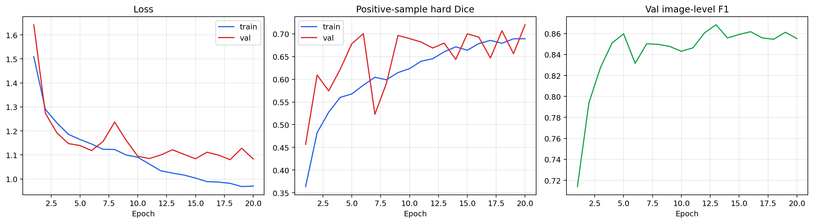
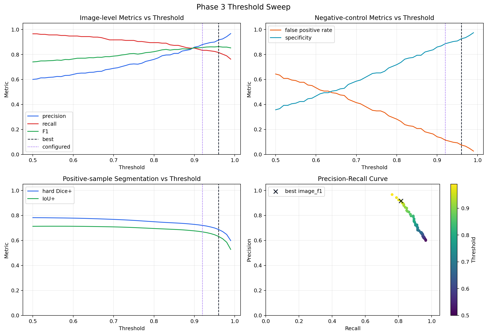
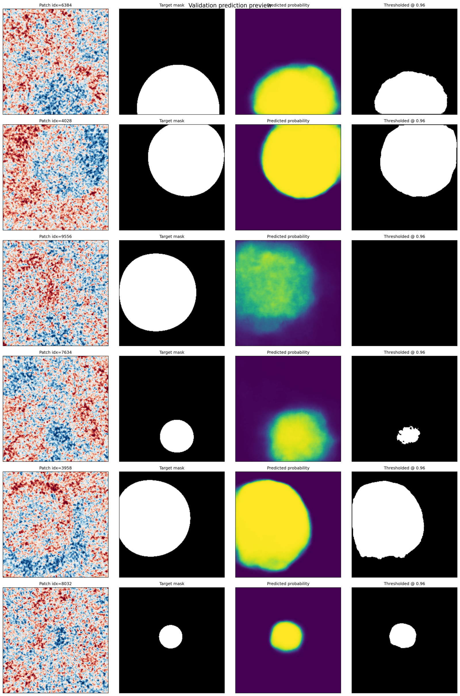
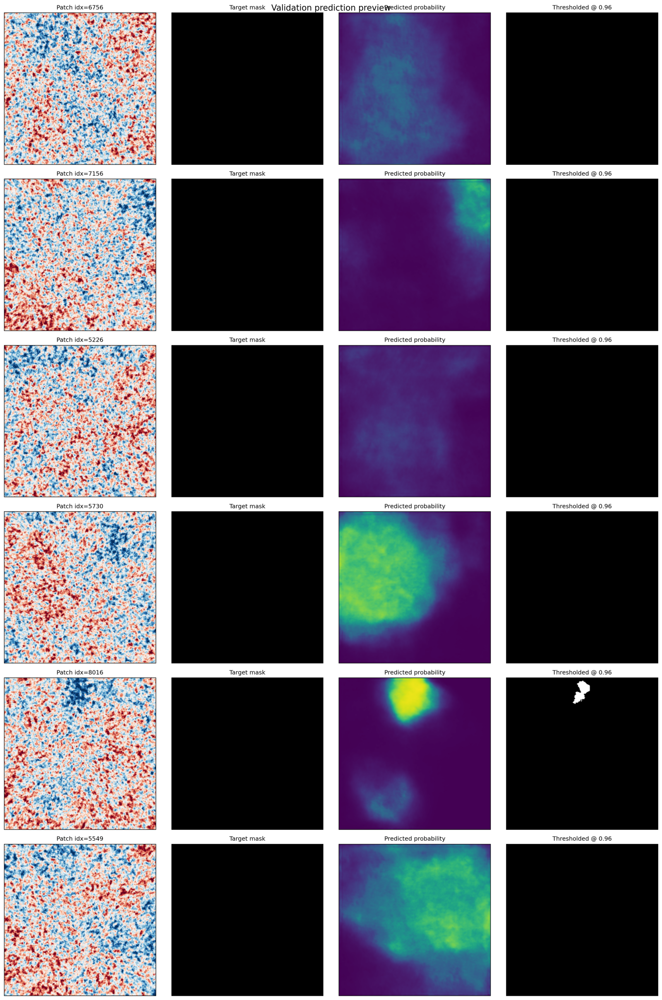

# CMB Bubble Collision Detection

A deep learning pipeline for detecting bubble collision signatures in Cosmic Microwave Background data using the Planck 2018 full sky release.

## Background

In 2011, Feeney, Johnson, Mortlock, and Peiris published the first observational search for bubble collision signatures in CMB data using classical Bayesian methods and blob detection on WMAP 7-year data. They found four candidate features, but the results were inconclusive due to sensitivity limitations. They explicitly called for the search to be repeated with Planck satellite data using more powerful computational tools.

The follow-up using modern deep learning remains largely unexplored.

This project builds a U-Net segmentation model trained on simulated bubble collision signatures and applies it to Planck 2018 CMB data — supplementing the classical pipeline with an ML screening stage.

## What Is a Bubble Collision Signature?

Some theories of cosmic inflation predict our universe is one bubble in a larger multiverse. If another bubble universe collided with ours, it would leave a physical imprint in the CMB: a circular, azimuthally symmetric temperature modulation confined to a disk on the sky. The signature is parameterized by five values:

- **z₀** — temperature amplitude at the center of the disk
- **z_crit** — temperature discontinuity at the causal boundary (edge)
- **θ_crit** — angular radius of the disk (searched range: 5°–25°)
- **θ₀, φ₀** — sky coordinates of the disk center

The signal model follows [Feeney et al. (2011), Eq. 1](https://arxiv.org/abs/1012.1995):

$$\frac{\delta T}{T} = \left[ \frac{z_{\text{crit}} - z_0 \cos\theta_{\text{crit}}}{1 - \cos\theta_{\text{crit}}} + \frac{z_0 - z_{\text{crit}}}{1 - \cos\theta_{\text{crit}}} \cos\theta \right] \Theta(\theta_{\text{crit}} - \theta)$$

## Progress

### Phase 1: Data Foundation - Complete

Downloaded the Planck 2018 SMICA cleaned CMB map, loaded and visualized HEALPix data, degraded to working resolution (Nside=256), applied the galactic mask, and extracted gnomonic (tangent-plane) projections as flat 256×256 patches at 13 arcmin/pixel.

**Full-sky Planck 2018 SMICA CMB (Nside=2048, 50 million pixels):**


**With galactic mask applied (78% sky unmasked) at Nside=256:**


**Gnomonic (flat-sky) patch near the CMB Cold Spot — this is the input format for the U-Net:**


### Phase 2: Synthetic Data Generator - Complete

Implemented the bubble collision signal model from Feeney et al. (2011) Eq. 1 and the multiplicative injection rule from Eq. 15. The training generator does not train on the single real SMICA sky. Instead, it generates many independent CAMB CMB realizations using Planck 2018 best-fit cosmological parameters and injects bubble-collision signals into those simulated skies. This makes the model learn the collision pattern on top of generic CMB fluctuations rather than one particular sky realization.

SMICA is still the inference target. The trained model will be run on the real Planck SMICA map. The Planck galactic mask is still used in Phase 2, but only to choose clean sky coordinates so the training patch geometry matches the final inference setup.

**Representative signal profiles used by the current generator:**


**Validation from the final 10000-sample Phase 2 dataset:**

The final dataset follows the `sin(theta_crit)` size prior, covers the full `1e-6` to `1e-4` amplitude range for both `z0` and `z_crit`, applies edge smoothing from `0.3°` to `1.0°`, and balances all four sign quadrants.


**Five representative Phase 2 examples from the final dataset:**

Each column shows the target mask, the injected template, and the raw patch, with concise sample parameters above. The examples include a blue disk, a red disk with a blue rim, a faint mixed-sign case, and two larger disks at different angular scales.


Phase 2 changes made for scientific reasons:
- [x] Replaced single-map SMICA training patches with many independent CAMB realizations
- [x] Kept the Planck mask to choose clean sky coordinates
- [x] Sampled $\theta_{\rm crit}$ from a training prior proportional to $\sin(\theta_{\rm crit})$, motivated by Eq.2 and chosen for this Planck-era synthetic generator.
- [x] Balanced the signs of $z_0$ and $z_{\rm crit}$ across all four sign combinations
- [x] Added boundary smoothing as a heuristic robustness augmentation motivated by the paper’s discussion of possible sub-degree boundary smearing.
- [x] Kept the target mask as the circular affected region on the sky
- [x] Fixed the CAMB normalization so the simulations use raw $C_\ell$ when generating CMB skies
- [x] Saved patches, labels, masks, parameters, and validation metadata to HDF5

Current Phase 2 status:
- [x] Built a valid coordinate pool from unmasked sky locations
- [x] Generated balanced positive and negative 256×256 training patches
- [x] Covered Feeney's 5°–25° angular range at 13 arcmin/pixel
- [x] Generated CAMB realizations for training backgrounds
- [x] Built an automated injection pipeline
- [x] Balanced $z_0$ and $z_{\rm crit}$ across all four sign quadrants
- [x] Applied edge smoothing in the range 0.3°–1.0° to every positive sample
- [x] Randomized the positive signal center within each patch to break center-bias shortcut learning
- [x] Completed basic dataset validation: parameter histograms, sign balance, NaN checks, and preview inspection
- [x] Ran a 1000-sample verification dataset locally
- [x] Ran a 10000-sample production dataset locally

### Phase 3: U-Net Model — Initial Baseline Complete

The Phase 3 training entrypoint is `scripts/phase3_train_unet.py`. It trains a U-Net with an EfficientNet encoder on the Phase 2 HDF5 dataset, uses a reproducible train/validation split, computes dataset normalization from the training subset, reweights BCE by the positive-pixel fraction, supports multi-GPU training, and saves checkpoints plus validation prediction previews.

The first full baseline run used the off-center 10k synthetic dataset, filtered positives to `|z| >= 3e-5` for the initial high-SNR pass, and trained on a balanced 4544-patch candidate set (4090 train / 454 val) across 2× RTX 3090 GPUs.

**Baseline synthetic-validation results from the finished 20-epoch run:**

| Setting | Threshold | Precision | Recall | Image F1 | False Positive Rate | Positive Dice | Positive IoU |
|---------|-----------|-----------|--------|----------|---------------------|---------------|--------------|
| Final training configuration | 0.92 | 0.879 | 0.833 | 0.855 | 0.115 | 0.720 | 0.668 |
| Best threshold from evaluator | 0.96 | 0.916 | 0.815 | 0.862 | 0.075 | 0.687 | 0.631 |

These numbers are on the held-out synthetic validation split, not on real Planck data yet. The key milestone is that the model now trains stably on off-center injections and no longer collapses into the earlier centered-disk shortcut.

**Training curves for the full 10k off-center baseline run:**



**Threshold sweep on the held-out synthetic validation split:**



**Positive validation examples at the evaluator-selected threshold (`0.96`):**

Each row shows the raw patch, the target mask, the model probability map, and the thresholded prediction.



**Negative validation examples at the evaluator-selected threshold (`0.96`):**

These rows are useful for checking whether the model is spuriously lighting up clean background patches.



### Phase 4: Validation — Upcoming

- Sensitivity curves at 5°, 10°, and 25° angular scales (detection rate vs. injection amplitude)
- False positive rate on clean (no injection) patches
- Precision-recall curves at varying detection thresholds
- Injection-recovery tests on real Planck maps
- GradCAM activation maps to verify model attention on correct spatial features
- Direct comparison to Feeney et al. (2011) sensitivity benchmarks (Figures 11, 17)

### Phase 5: Planck Inference — Upcoming

Tile the full unmasked Planck sky with overlapping ~51° patches. Run inference and stitch outputs into a full-sky probability map. Identify candidate regions above detection threshold. Cross-reference against known CMB anomalies (Cold Spot, hemispherical asymmetry). Validate candidates across independent Planck cleaning pipelines (SMICA, NILC, SEVEM, Commander).

### Phase 6: Paper and Release — Upcoming

Write up results. Release trained model weights, synthetic data generator, and inference pipeline as open-source tools for the CMB research community.

## Quick Start

```bash
# Set up the environment
conda env create -f environment.yml
conda activate cmb

# Phase 1: Download Planck data and generate exploration plots
python scripts/phase1_explore.py

# Phase 2: Generate signal model visualizations
python scripts/phase2_signal_model.py

# Phase 2: Generate training patches using CAMB realizations and Planck mask geometry
python scripts/phase2_generate_training.py

# First verification pass
python scripts/phase2_generate_training.py --num-samples 1000 --pool-size 2000 --num-cmb-realizations 192

# Larger local training set
python scripts/phase2_generate_training.py --num-samples 10000 --pool-size 5000 --num-cmb-realizations 192

# Phase 3: inspect the training split and normalization without starting training
python scripts/phase3_train_unet.py --dry-run

# Phase 3: train the segmentation model on the 10k off-center synthetic dataset
python scripts/phase3_train_unet.py --data-h5 data/training_v3_10000/training_data.h5 --epochs 20 --batch-size 16 --threshold 0.92

# Phase 3: evaluate a finished run and sweep thresholds on the validation split
python scripts/phase3_evaluate_run.py --run-dir runs/phase3_unet/phase3_offcenter_10k_2gpu --checkpoint best --split val --num-workers 0
```

For Phase 3 you still need a PyTorch install that matches your CUDA setup. A typical RTX 3090 setup is:

```bash
conda install pytorch torchvision pytorch-cuda=11.8 -c pytorch -c nvidia
```

## Datasets

| Dataset            | Purpose                                        | Source                                             |
|--------------------|------------------------------------------------|----------------------------------------------------|
| Planck 2018 SMICA  | Primary inference target                       | [Planck Legacy Archive](https://pla.esac.esa.int/) |
| CAMB simulations   | Synthetic CMB realizations for training        | Generated via [CAMB](https://camb.info/)           |
| CMB-ML (ICCV 2025) | Pre-processed CMB data for ML                  | [CMB-ML](https://github.com/CMB-ML)               |
| WMAP 7-year        | Additional validation / generalization testing | [LAMBDA](https://lambda.gsfc.nasa.gov/)            |

## Tech Stack

- **healpy** — HEALPix map handling and patch extraction
- **CAMB** — CMB power spectrum and map simulation
- **PyTorch** — Model training and inference
- **segmentation-models-pytorch** — U-Net with EfficientNet encoder
- **numpy / scipy** — Signal injection and data processing

## Hardware

- 2× NVIDIA RTX 3090 (48 GB VRAM total)

## Key References

- Feeney, Johnson, Mortlock & Peiris (2011). *First Observational Tests of Eternal Inflation: Analysis Methods and WMAP 7-Year Results.* [arXiv:1012.3667](https://arxiv.org/abs/1012.3667)
- Feeney, Johnson, Mortlock & Peiris (2011). *First Observational Tests of Eternal Inflation* [arXiv:1012.1995](https://arxiv.org/abs/1012.1995)
- Zhang et al. (2024). *CMBubbles: Bubble Collision Detection in the CMB.*
- Górski et al. (2005). *HEALPix: A Framework for High-Resolution Discretization and Fast Analysis of Data Distributed on the Sphere.*

## Why This Matters

This project is not a discovery tool. It is a triage tool. It screens the full CMB sky in minutes and outputs a probability map flagging regions of interest for follow-up with traditional Bayesian analysis. Even a null result constrains the bubble collision parameter space. The pipeline is designed to be reusable on future CMB datasets (CMB-S4, Simons Observatory) where automated screening will be essential due to data volume.

## License

MIT

## Authors

William Starks

Gus Marcum
